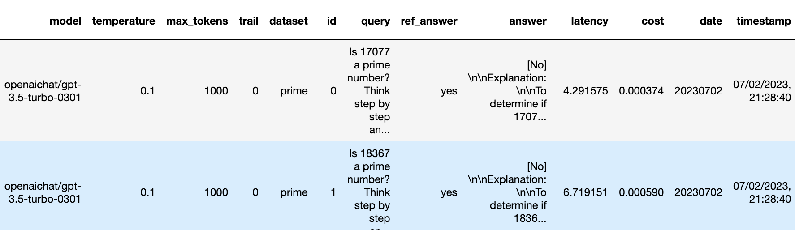

# 🎓 LLM Drifts: How Is ChatGPT’s Behavior Changing over Time?


Large language models (LLM) services such as GPT-4 and GPT-3.5 are widely being used. However, when and how these models are updated over time is opaque. Towards filling in this gap, this repository contains (i) a diverse set of _datasets_, and (ii) _generations_ from popular LLMs (including GPT-4 and GPT-3.5) on these datasets over time. 


These generations reveal many interesting LLM drifts. For example, GPT-4 (March 2023) was very good at identifying prime numbers (accuracy 97.6%)
but GPT-4 (June 2023) was very poor on these same questions (accuracy 2.4%). Interestingly
GPT-3.5 (June 2023) was much better than GPT-3.5 (March 2023) in this task. We hope releasing the datasets and generations can help the community to understand how LLM services drift better.

## 🚀 Getting Started

You can directly run the  [Google Colab Notebook](https://colab.research.google.com/github/lchen001/LLMDrift/blob/main/Intro.ipynb) to reproduce the monitored performance drifts in [our paper](). You don't need API keys to get started.


## 🔧 Installation
You can also install FrugalGPT locally by running the following commands:

```
git clone https://github.com/lchen001/LLDrift
cd LLDrift
pip install 

```
 

Now you are ready to use the [local intro notebook](intro.ipynb)!


## 💾 Datasets and Generations
The datasets and generations can be found under ```generation/```. Each csv file corresponds to one dataset. One record/row corresponds to one query and the generation from one LLM service.


<p align="center">
  
</p>
<p align="left">
  <b>Figure 1:</b> The first few rows in the LLM  generations on PRIME dataset.
</p>

The above figure shows the first few rows in the ```generation/PRIME_EVAL.csv```. It includes the model, query parameters (such as temperature), the query, the reference answer, the generated answer, and latency.  Such information could be leverage to study various aspects of LLM services.

## 📚 Read More


You can find more details in the academic paper:
* [**How Is ChatGPT’s Behavior Changing over Time?**](https://arxiv.org/pdf/2307.XXXX.pdf)

## 🎯 Reference

If you use our findings and/or datasets in a research paper, please cite our work as follows:


```
@article{chen2023LLMDrift,
  title={How Is ChatGPT’s Behavior Changing over Time?},
  author={Chen, Lingjiao and Zaharia, Matei and Zou, James},
  journal={arXiv preprint arXiv:2307.XXXX},
  year={2023}
}
```